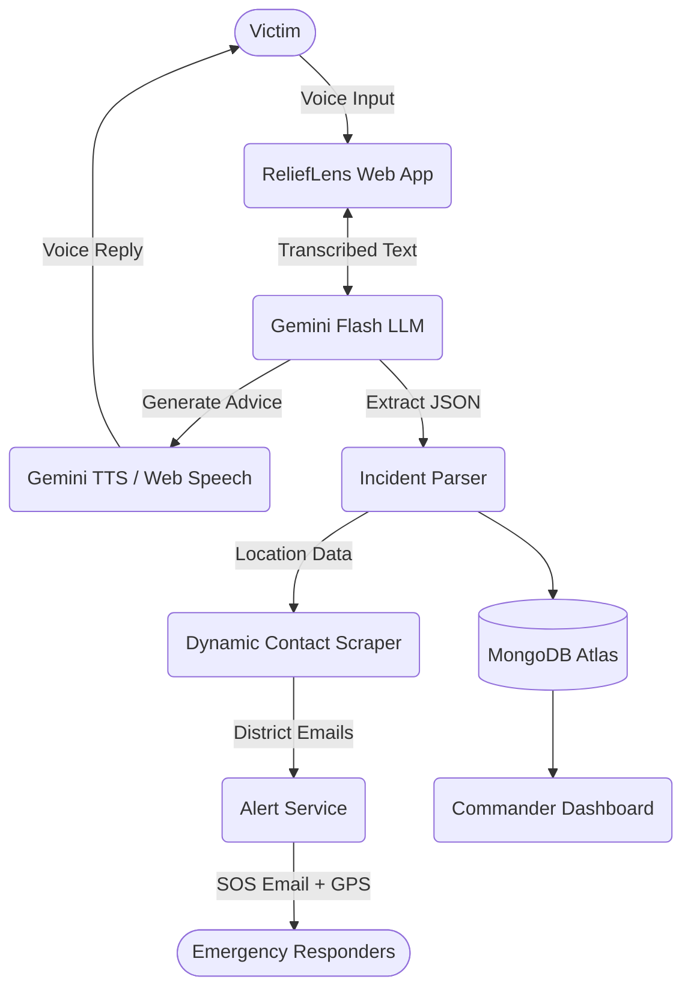

# ReliefLens 🚨

**Disaster Decision Acceleration System**

ReliefLens is an advanced, AI-powered emergency dispatch interface designed to bridge the gap between disaster victims and emergency commanders. By leveraging cutting-edge LLMs and voice synthesis, ReliefLens turns chaotic, unstructured emergency calls into structured, triaged data for first responders.

---

## 🛑 Problem Statement

During natural disasters (floods, earthquakes, fires), communication networks break down and panic sets in. 
1. **Victims** struggle to articulate their exact location or the severity of their situation.
2. **Dispatch Centers** become overwhelmed by thousands of unorganized, frantic calls.
3. **First Responders** are deployed blindly because they lack triaged data, leaving them unsure of who needs help the most urgently.

## 💡 Solution Features

ReliefLens acts as an automated, highly intelligent emergency dispatcher that lives in a web browser.
- **ARIA Voice Assistant:** An empathetic, AI-powered voice assistant (featuring a calming female persona) that talks to victims. No complex forms to fill out—just talk.
- **Multilingual Support:** ARIA automatically understands and speaks English, Hindi, and Tamil, flawlessly switching between them with perfect native pronunciation.
- **Instant Data Extraction:** As the victim speaks, ARIA instantly extracts critical details (Emergency Type, Location, Severity, Number of Victims).
- **Automated Rescue Alerts:** The system determines the user's district, dynamically scrapes local emergency contact emails, and automatically dispatches a detailed SOS alert with exact GPS coordinates.
- **Commander Dashboard:** A "Tactical Futurism" dashboard for rescue workers that sorts incoming emergencies from highest to lowest priority.
- **Anti-Hallucination Advice:** Uses Retrieval-Augmented Generation (RAG) to fetch verified, localized disaster survival protocols before giving advice.

---

## 🛠️ Tech Stack

- **Frontend:** React 18, Vite, TypeScript, Tailwind CSS, Framer Motion, Lucide Icons
- **AI & LLMs:** Google Gemini 2.5 Flash (English) & Gemini 2.0 Flash (for unmatched Indic language phonemes)
- **Voice Intelligence (TTS/STT):** Gemini TTS API (Aoede profile) with a robust, strict-female Web Speech API fallback mechanism.
- **Database & RAG:** MongoDB Atlas (Vector Search)
- **Backend Services:** Node.js / Express (for contact scraping and email routing)

---

## 🏗️ Architecture Diagram



---

## 🔄 Workflow

1. **Trigger:** A victim opens the app and presses the "Hold to Speak" button to talk to ARIA or they can upload an image or text of the disaster you are going through
2. **Process:** The voice is transcribed and processed by Gemini Flash models.
3. **Extract:** Gemini instantly extracts the incident details (type, severity, victims, location).
4. **Respond:** ARIA speaks back with calm, localized survival instructions in the victim's language.
5. **Route:** The backend fetches emergency contact emails for the user's specific district.
6. **Dispatch:** SOS emails are dispatched to regional authorities.
7. **Command:** The incident card appears on the Commander Dashboard, triaged by severity for first responders.

---

## 💻 Installation & Setup

1. **Clone the repository:**
   ```bash
   git clone https://github.com/rubipreethi-official/ReliefLens--AI-Disaster-Intelligence-Assistant.git
   cd ReliefLens
   ```

2. **Install dependencies:**
   ```bash
   npm install
   ```

3. **Configure Environment Variables:**
   Create a `.env.local` file in the root directory and add your credentials:
   ```env
   VITE_GOOGLE_AI_API_KEY=your_gemini_api_key
   MONGO_URI=your_mongodb_connection_string
   # Add other required email/scraping credentials here
   ```

4. **Run the development server:**
   ```bash
   npm run dev:all
   ```
   *This command spins up both the frontend Vite server and the backend Express services concurrently.*

---

## 🎥 Demo Video

> **[Insert Link to Demo Video Here]**
> *(Upload your 5-minute explanation and walkthrough video to YouTube or Vimeo and link it here, or embed a GIF of the interface in action.)*

---

## 🚀 Future Scope

- **Satellite Imagery Integration:** Real-time damage assessment using geospatial APIs.
- **Offline-First Capabilities:** Integrating localized Small Language Models (SLMs) and on-device Whisper models for complete offline functionality when cell towers are down.
- **Direct Dispatch API Integration:** Bypassing email to inject incident data directly into national emergency service systems (e.g., 911 / 112 CAD systems).
- **Multi-Channel Alerts:** Integrating Twilio or WhatsApp Business APIs for instant SMS/WhatsApp SOS broadcasts.

---

*Built with passion to accelerate decisions and save lives.*
